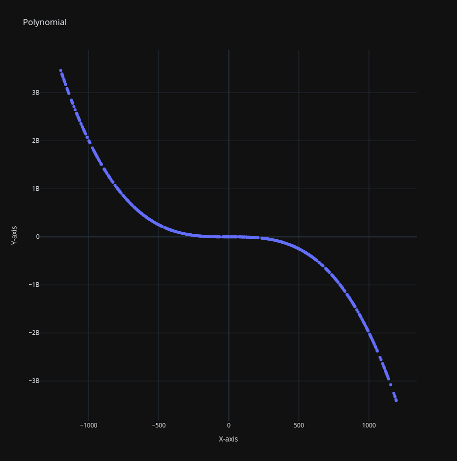

# Data Mining Task - Predicting Y-Coordinates

## Description

Your task in this [CodeWars challenge](https://www.codewars.com/kata/591748b3f014a2593d0000d9/train/python) is to build a predictive model that can predict the y-coordinate of points. The model should be trained on a given dataset, and the accuracy of your model will be assessed using the Root Mean Squared Error (RMSE) metric.

This challenge involves creating a mining model, which is a set of data, statistics, and patterns derived from an algorithm. This model will be used to make predictions on new data points based on the relationships learned from the training data.

### Task Difficulty

There are multiple levels of difficulty for this task, with more complex polynomial relationships in the test cases. The task description mentions that points in the test cases are generated from polynomials of up to the 5th degree.

### Sample Plot

To illustrate the task, here's a sample plot of points generated from a polynomial relationship:



This plot represents a simplified example of the data you'll be working with. Your model will need to learn the underlying patterns and relationships in the data to make accurate predictions.

## Implementation

You will need to implement the following components:

1. **Scaler Class**: The Scaler class is responsible for scaling and restoring data. It scales input data by dividing each value by the maximum value and restores scaled data by multiplying each value by the maximum value. This class ensures that the input and output values are within a common range.

2. **Neuron Class**: The Neuron class represents a neuron in a neural network. It is responsible for updating its weights and bias using backpropagation during the training phase and making predictions during the testing phase.

3. **PowerFunc Class**: The PowerFunc class is the core of your predictive model. It initializes and manages the neurons and provides methods for prediction and training.

4. **Datamining Class**: The Datamining class is responsible for preprocessing the training data, scaling it using the Scaler class, and training the PowerFunc model. It also provides a predict method to make predictions on new data points.

## Usage

Here's how you can use the provided code:

1. Initialize the Datamining class with your training dataset.

2. Train the model using the training data.

3. Use the `predict` method to predict y-coordinates for new data points.

## Dependencies

This code does not rely on external libraries such as scikit-learn, pandas, TensorFlow, NumPy, or SciPy, as specified in the challenge requirements.

## Example

```python
from data_mining import Datamining

# Sample training data (Replace with your own dataset)
train_set = [(x1, y1), (x2, y2), ...]

# Initialize the Datamining class with the training data
dm = Datamining(train_set)

# Train the model
# The model will learn the relationships between x and y coordinates

# Predict y-coordinate for a new data point
x_new = 42.0
y_predicted = dm.predict(x_new)
```

## Evaluation

The performance of your predictive model will be assessed based on its ability to accurately predict y-coordinates for new data points. The evaluation metric used for this task is the Root Mean Squared Error (RMSE).

### Root Mean Squared Error (RMSE)

RMSE is a commonly used metric to measure the accuracy of regression models. It calculates the square root of the average of the squared differences between predicted and actual values. In the context of this challenge:

- Lower RMSE indicates better model performance.
- RMSE quantifies the average prediction error, with smaller values indicating a closer fit to the actual data.
- It provides a measure of how well the model generalizes to new, unseen data points.

To evaluate your model, you can compare the RMSE of your predictions against the ground truth (actual y-coordinates) for the test data. The goal is to minimize the RMSE, indicating that your model accurately predicts y-coordinates for a wide range of data points.

Ensure that your model performs well across different test cases with varying degrees of complexity, as mentioned in the task description.

Keep in mind that the evaluation process will involve testing your model on unseen data, so a lower RMSE indicates a more accurate and effective predictive model.
